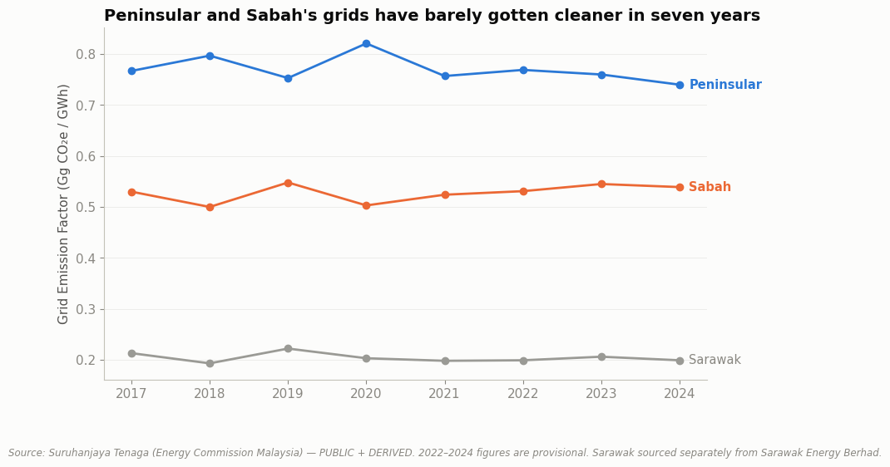

# Malaysia Grid Decarbonization: On Track or Overstated? (2017–2024)



## The Question

Is Malaysia's electricity grid decarbonizing fast enough to meet its own climate commitments — and what does that pace mean for a business deciding whether to wait on the grid vs. invest in its own renewable capacity (PPAs, on-site solar) to hit its emissions targets?

## Status

✅ **Analysis complete.** Two notebooks — the first measuring the grid emission factor trend itself across all three regions, the second decomposing what's actually driving it and checking that against Malaysia's published renewable energy targets.

## Key Findings

**1. Peninsular and Sabah's grids have barely gotten cleaner in seven years — and Sabah's got slightly dirtier.** Peninsular Malaysia's grid emission factor fell just 3.5% from 2017 to 2024, and most of that decline is a rebound from a single anomalous 2020 peak rather than a steady trend (2021's figure is barely below 2017's). Sabah's grid emission factor rose slightly over the same window. Only Sarawak — already the cleanest of the three by a wide margin due to its hydro-heavy grid — shows a real decline, from a structurally different starting point. *([Notebook 01](./notebooks/01-grid-emission-factor-trend.ipynb))*

**2. The reason the trend is flat: coal's share of the fuel mix went up, not down.** Coal was 63.9% of Peninsular Malaysia's generation fuel mix in 2017 and 67.9% in 2024 — it never dropped below its 2017 starting share in any year of the series. Malaysia's National Energy Transition Roadmap targets 31% renewable installed capacity by 2025, but that's a capacity metric, not a generation metric — and whatever renewable capacity exists, it has not been enough to reduce coal's share of what actually gets burned. *([Notebook 02](./notebooks/02-fuel-mix-and-policy-context.ipynb))*

## Why This Project

Businesses operating in Malaysia increasingly build "the grid will get cleaner" into their own emissions-reduction plans — but that assumption is rarely checked against the actual multi-year record. This project tests it directly, using Malaysia's own official grid emission factor and fuel-mix data, and is explicit about where the available public data can and can't answer the underlying policy question (capacity targets vs. generation outcomes are not the same metric, and this project does not conflate them).

## Data Sources

The source PDFs are official government publications; the CSVs used in analysis are hand-transcribed from those PDF tables (no machine-readable download exists), so all three are labeled **DERIVED**, not PUBLIC — same convention as `ecommerce_income.csv` in the e-commerce case study. Full definitions and known limitations are documented in [`DATA_DICTIONARY.md`](./DATA_DICTIONARY.md).

| Dataset | Source | Classification | Frequency |
|---|---|---|---|
| Grid Emission Factor (Peninsular, Sabah, Sarawak) | Suruhanjaya Tenaga (Energy Commission Malaysia) | DERIVED | Annual |
| Fuel mix underlying Peninsular's GEF (coal/gas/diesel/fuel oil) | Suruhanjaya Tenaga (Energy Commission Malaysia) | DERIVED | Annual |
| Renewable energy installed capacity targets | National Energy Transition Roadmap (NETR), Government of Malaysia | DERIVED | Policy targets (not a time series) |

**Real limitations, stated plainly rather than buried:** the source GEF methodology excludes renewable generation from its fuel-consumption accounting entirely, so this project can describe the coal/gas mix shift precisely but cannot state Malaysia's actual renewable *generation* share for any year — only its *capacity* target, which is a different metric. 2022 figures were also revised between the two source publications; this project uses the restated figures throughout. Both are discussed directly in the notebooks' Confidence & Caveats sections.

## Notebooks

| # | Question | Data Rigor |
|---|---|---|
| [01 — Grid Emission Factor Trend](./notebooks/01-grid-emission-factor-trend.ipynb) | Has Malaysia's grid actually gotten cleaner since 2017, and at what pace, across all three regions? | PUBLIC + DERIVED |
| [02 — Fuel Mix & Policy Context](./notebooks/02-fuel-mix-and-policy-context.ipynb) | What's driving Peninsular Malaysia's flat trend, and how does it compare to Malaysia's renewable energy targets? | PUBLIC + DERIVED |

## Methodology

Business problem → objectives → data acquisition → cleaning → analysis → visualization → insight → recommendation. Each notebook opens with the question and the answer, then shows the reasoning between them — including where the available public data cannot fully answer the policy-level question, stated directly rather than glossed over.

## Reproducing This Analysis

```bash
pip install -r requirements.txt
jupyter notebook notebooks/
```

All data used is already included in `data/processed/` — notebooks read directly from there, so no external downloads are required to re-run the analysis.

## Repository Structure

```
data/
├── raw/          # Original files, unmodified, as downloaded from source
└── processed/    # Cleaned/compiled datasets ready for analysis
notebooks/        # Analysis notebooks
references/       # Source PDFs and supporting documents
DATA_DICTIONARY.md
```

## Author

Darren Ooi — [LinkedIn](https://www.linkedin.com/in/darrenooizhixian)
